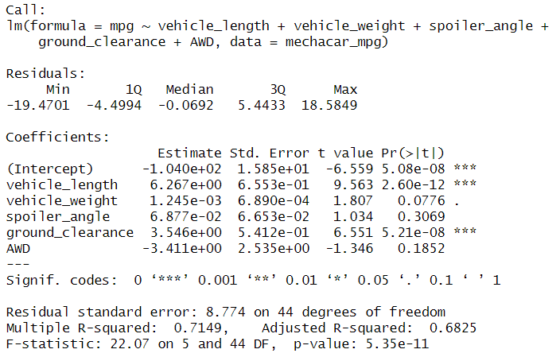
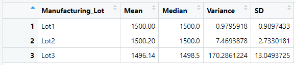

# MechaCar_Statistical_Analysis

## Linear Regression to Predict MPG

#### -Which variables/coefficients provided a non-random amount of variance to the mpg values in the dataset?
Vehicle Length and Ground Clearance
#### -Is the slope of the linear model considered to be zero? Why or why not?
The slope of the linear model is not considered to be zero. The p-value is smaller than the significance level which means the null hypothesis is not true.
#### -Does this linear model predict mpg of MechaCar prototypes effectively? Why or why not?
The r-squared value of the linear regression model is 0.7149. This is 71.49% which means the linear model does predict mpg of MechaCar prototypes effectively.

## Summary Statistics on Suspension Coils
#### -The design specifications for the MechaCar suspension coils dictate that the variance of the suspension coils must not exceed 100 pounds per square inch. Does the current manufacturing data meet this design specification for all manufacturing lots in total and each lot individually? Why or why not?
When you look at the total_summary, the variance is 62.3. This shows that the variance does meet the design specifications of the manufacturer.
In the lot_summary, lot 3 has a variance over 100 and is therefore over the requirement.

