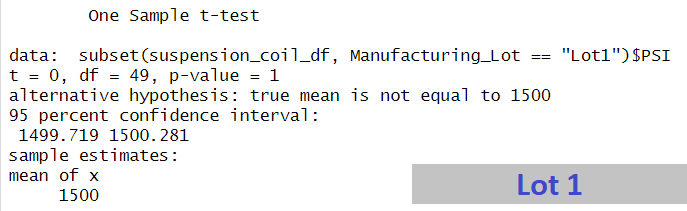

# MechaCar_Statistical_Analysis

## Linear Regression to Predict MPG

#### -Which variables/coefficients provided a non-random amount of variance to the mpg values in the dataset?
Vehicle Length and Ground Clearance
#### -Is the slope of the linear model considered to be zero? Why or why not?
The slope of the linear model is not considered to be zero. The p-value is smaller than the significance level which means the null hypothesis is not true.
#### -Does this linear model predict mpg of MechaCar prototypes effectively? Why or why not?
The r-squared value of the linear regression model is 0.7149. This is 71.49% which means the linear model does predict mpg of MechaCar prototypes effectively.

## Summary Statistics on Suspension Coils
#### -The design specifications for the MechaCar suspension coils dictate that the variance of the suspension coils must not exceed 100 pounds per square inch. Does the current manufacturing data meet this design specification for all manufacturing lots in total and each lot individually? Why or why not?
When you look at the total_summary, the variance is 62.3. This shows that the variance does meet the design specifications of the manufacturer.
In the lot_summary, lot 3 has a variance over 100 and is therefore over the requirement.

## T-Tests on Suspension Coils
Looking at the T-Test results for all three manufacturing lots show that they are not that statistically different than the population mean. 

#### Lot One

#### Lot Two

#### Lot Three

## Study Design: MechaCar vs Competition
I would like to perform an analysis on vehicle weight and vehicle length compared to average miles per gallon. This comparison could be helpful for people looking for larger vehicles but not wanting to sacrifice high miles per gallon.

#### What metric or metrics are you going to test?
With this study, I would test the vehicle weight and vehicle length compared to miles per gallon.

#### What is the null hypothesis or alternative hypothesis?
The null hypothesis is that vehicle miles per gallon is not affected by vehicle weight or length.
The alternative hypothesis is that a larger vehicle weight and length results in lower miles per gallon.

#### What statistical test would you use to test the hypothesis? And why?
I would use a two sample T-Test to test the hypothesis since I will be using two samples: vehicle length and vehicle weight.

#### What data is needed to run the statistical test?
The data needed would be vehicle length, vehichle weight, and average miles per gallon.
